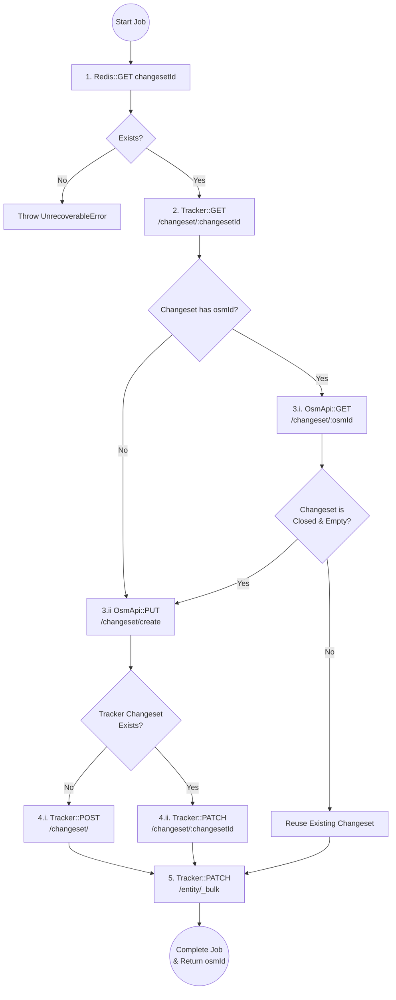
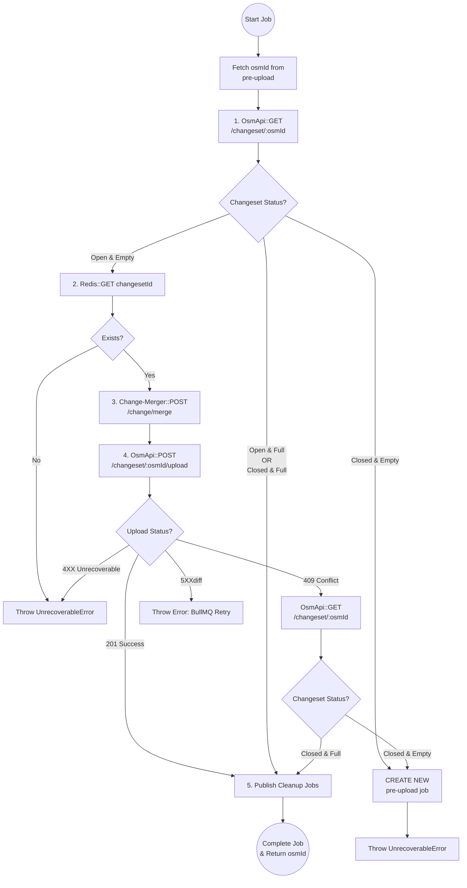
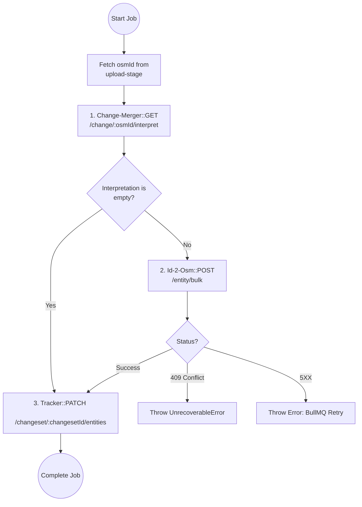
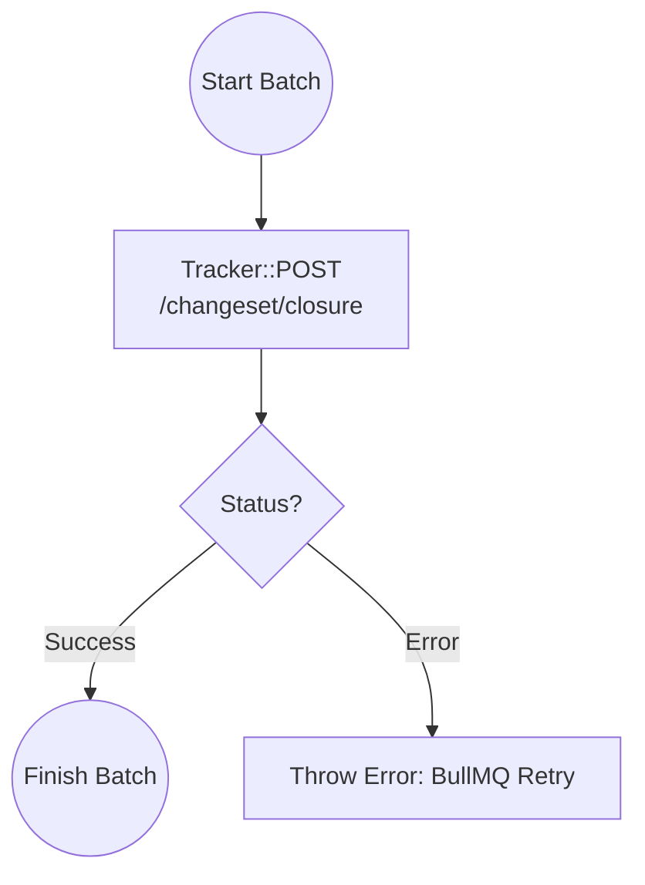

# naephi
- nae: Scottish English or Northern English for no or not
- phi ( Φ, φ ):
    1. a plane angle.
    2. a polar coordinate.
    3. in mathematics, the Greek letter φ denotes the golden ratio.

`naephi` leverages `BullMQ` flow to build an `OSM` `changeset` upload flow, that is being processed in 4 stages:

### Stage I: pre-upload
In this stage we set the environment before the actual upload - this includes generating a `changeset` on `osm-api` and setting the tracked resources on `osm-sync-tracker`.



### Stage II: upload:
This stage is responsible for the actual delivery of data to OSM. It transforms local changes into a valid OSM XML changeset and performs the upload. A key feature of this stage is its state-awareness: it can detect if an upload is redundant (already full) or if the environment has become invalid (closed empty), in which case it triggers a flow recovery.



### Stage III: post upload:
This stage performs ID reconciliation in `id-2-osm`. It fetches the permanent OSM IDs generated during the upload using `change-merger` interpretation, maps them to local entities, and finalizes the tracking state.



### Stage IV: closure
The purpose of this final stage is triggering asynchronous lifecycle finalization in `osm-sync-tracker`. Operating as a batch worker, it aggregates multiple completed flows to signal `osm-sync-tracker` that these changesets are up for closure, triggering closure chain reaction.



## API
Checkout the OpenAPI spec [here](/openapi3.yaml)


## Running Tests

To run tests, run the following command

```bash

npm run test

```

To only run unit tests:
```bash
npm run test:unit
```

To only run integration tests:
```bash
npm run test:integration
```
