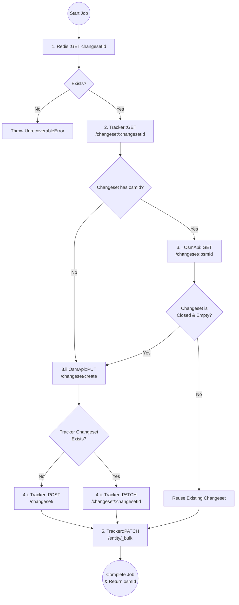
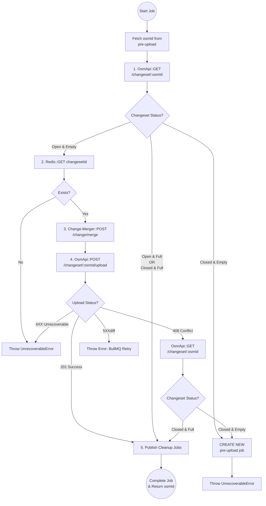
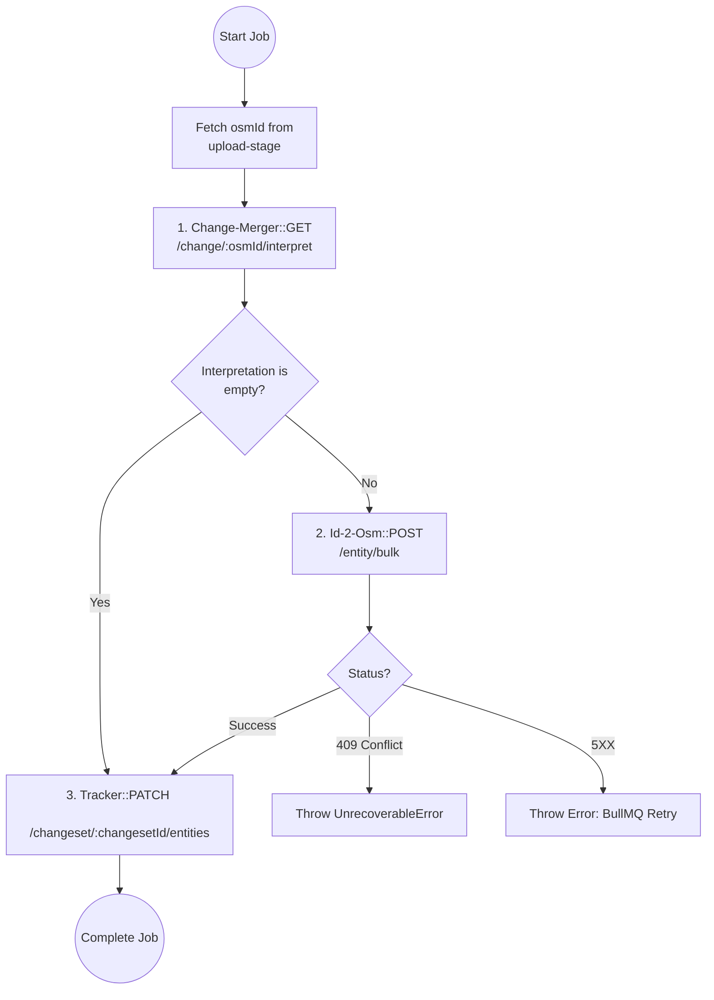
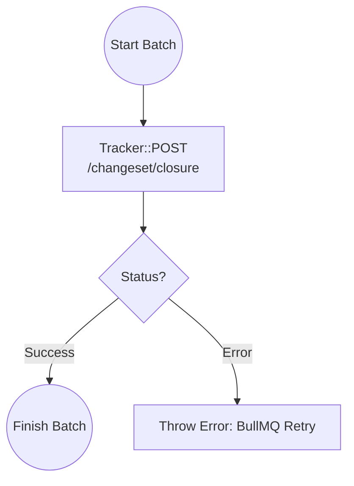

# naephi
- nae: Scottish English or Northern English for no or not
- phi ( Φ, φ ):
    1. a plane angle.
    2. a polar coordinate.
    3. in mathematics, the Greek letter φ denotes the golden ratio.

`naephi` leverages `BullMQ` flow to build an `OSM` `changeset` upload flow, that is being processed in 4 stages:

### Stage I: pre-upload
In this stage we set the environment before the actual upload - this includes generating a `changeset` on `osm-api` and setting the tracked resources on `osm-sync-tracker`.



### Stage II: upload:
This stage is responsible for the actual delivery of data to OSM. It transforms local changes into a valid OSM XML changeset and performs the upload. A key feature of this stage is its state-awareness: it can detect if an upload is redundant (already full) or if the environment has become invalid (closed empty), in which case it triggers a flow recovery.



### Stage III: post upload:
This stage performs ID reconciliation in `id-2-osm`. It fetches the permanent OSM IDs generated during the upload using `change-merger` interpretation, maps them to local entities, and finalizes the tracking state.



### Stage IV: closure
The purpose of this final stage is triggering asynchronous lifecycle finalization in `osm-sync-tracker`. Operating as a batch worker, it aggregates multiple completed flows to signal `osm-sync-tracker` that these changesets are up for closure, triggering closure chain reaction.



## API
Checkout the OpenAPI spec [here](/openapi3.yaml)


## Configuration

All configuration values can be set via environment variables. Values marked as **Required** have no default and must be provided.

---

## Server

| Key | Env Var | Type | Required | Default | Description |
|-----|---------|------|----------|---------|-------------|
| `server.port` | `SERVER_PORT` | number | No | `8080` | HTTP port the server listens on |
| `server.request.payload.limit` | `REQUEST_PAYLOAD_LIMIT` | string | No | `1mb` | Maximum request payload size |
| `server.response.compression.enabled` | `RESPONSE_COMPRESSION_ENABLED` | boolean | No | `true` | Enable response compression |

---

## Telemetry

| Key | Env Var | Type | Required | Default | Description |
|-----|---------|------|----------|---------|-------------|
| `telemetry.serviceName` | `TELEMETRY_SERVICE_NAME` | string | Yes | — | Service name reported to telemetry backends |
| `telemetry.hostname` | `TELEMETRY_HOST_NAME` | string | Yes | — | Hostname reported to telemetry backends |
| `telemetry.version` | `TELEMETRY_SERVICE_VERSION` | string | Yes | — | Service version reported to telemetry backends |
| `telemetry.logger.level` | `LOG_LEVEL` | string | No | `info` | Log level (`trace`, `debug`, `info`, `warn`, `error`, `fatal`) |
| `telemetry.logger.prettyPrint` | `LOG_PRETTY_PRINT_ENABLED` | boolean | No | `false` | Enable pretty-printed log output |
| `telemetry.tracing.enabled` | `TELEMETRY_TRACING_ENABLED` | boolean | No | `false` | Enable distributed tracing |
| `telemetry.tracing.url` | `TELEMETRY_TRACING_URL` | string | No | — | Tracing collector URL |
| `telemetry.metrics.enabled` | `TELEMETRY_METRICS_ENABLED` | boolean | No | `false` | Enable metrics export |
| `telemetry.metrics.url` | `TELEMETRY_METRICS_URL` | string | No | — | Metrics collector URL |
| `telemetry.metrics.interval` | `TELEMETRY_METRICS_INTERVAL` | number | No | — | Metrics export interval in ms |

---

## App

| Key | Env Var | Type | Required | Default | Description |
|-----|---------|------|----------|---------|-------------|
| `app.uiPath` | `APP_UI_PATH` | string | No | `/ui` | Path to serve the UI from |
| `app.initTimeout` | `APP_INIT_TIMEOUT` | number | No | `30000` | Worker initialization timeout in ms |
| `app.osmIdResolver` | `APP_OSM_ID_RESOLVER` | string | No | `tracker` | OSM ID resolver strategy (`tracker` or `childJob`) |

---

## Flows

### `changesetUpload`

| Key | Env Var | Type | Required | Default | Description |
|-----|---------|------|----------|---------|-------------|
| `app.flows.changesetUpload.maxAttempts` | `APP_FLOWS_CHANGESET_UPLOAD_MAX_ATTEMPTS` | number | No | `10` | Maximum number of flow re-initialization attempts before aborting |

---

## Queues

All queues share the same configuration structure. Fields marked as **Required** must be provided for each queue.

### Queue Env Var Prefixes

| Queue | Env Var Prefix |
|-------|---------------|
| `changesetPreUpload` | `APP_QUEUES_CHANGESET_PRE_UPLOAD` |
| `changesetUpload` | `APP_QUEUES_CHANGESET_UPLOAD` |
| `changesetPostUpload` | `APP_QUEUES_CHANGESET_POST_UPLOAD` |
| `changesetClosure` | `APP_QUEUES_CHANGESET_CLOSURE` |
| `changesetRedisCleanup` | `APP_QUEUES_CHANGESET_REDIS_CLEANUP` |
| `changesetOsmCleanup` | `APP_QUEUES_CHANGESET_OSM_CLEANUP` |

### Job Options

| Key | Env Var suffix | Type | Required | Default | Description |
|-----|----------------|------|----------|---------|-------------|
| `jobOptions.attempts` | `_JOB_ATTEMPTS` | number | No | `3` | Maximum number of job attempts |
| `jobOptions.delay` | `_JOB_DELAY` | number | No | `0` | Delay in ms before the job is processed |
| `jobOptions.backoff.type` | `_JOB_BACKOFF_TYPE` | string | No | `exponential` | Backoff strategy (`exponential` or `fixed`) |
| `jobOptions.backoff.delay` | `_JOB_BACKOFF_DELAY` | number | No | `1000` | Base backoff delay in ms |

### Worker Options

| Key | Env Var suffix | Type | Required | Default | Description |
|-----|----------------|------|----------|---------|-------------|
| `workerOptions.concurrency` | `_WORKER_CONCURRENCY` | number | No | `1` | Number of jobs processed concurrently |
| `workerOptions.limiter.max` | `_WORKER_LIMITER_MAX` | number | No | `100` | Max jobs processed per limiter duration (only applied when limiter is enabled) |
| `workerOptions.limiter.duration` | `_WORKER_LIMITER_DURATION` | number | No | `1000` | Limiter window duration in ms (only applied when limiter is enabled) |
| `workerOptions.maxStalledCount` | `_WORKER_MAX_STALLED_COUNT` | number | No | `1` | Max number of times a job can stall before failing |
| `workerOptions.stalledInterval` | `_WORKER_STALLED_INTERVAL` | number | No | `30000` | Interval in ms to check for stalled jobs |
| `workerOptions.removeOnComplete.age` | `_WORKER_REMOVE_ON_COMPLETE_AGE` | number | No | `3600` | Max age in seconds to keep completed jobs |
| `workerOptions.removeOnComplete.count` | `_WORKER_REMOVE_ON_COMPLETE_COUNT` | number | No | `100` | Max number of completed jobs to keep |
| `workerOptions.removeOnFail.age` | `_WORKER_REMOVE_ON_FAIL_AGE` | number | No | `86400` | Max age in seconds to keep failed jobs |
| `workerOptions.removeOnFail.count` | `_WORKER_REMOVE_ON_FAIL_COUNT` | number | No | `1000` | Max number of failed jobs to keep |

### Batch Options *(only applicable to batch workers which are `changesetClosure`, `changesetRedisCleanup`, `changesetOsmCleanup`)*

| Key | Env Var suffix | Type | Required | Default | Description |
|-----|----------------|------|----------|---------|-------------|
| `batchOptions.size` | `_BATCH_SIZE` | number | No | `10` | Maximum batch size that triggers an immediate flush |
| `batchOptions.minSize` | `_BATCH_MIN_SIZE` | number | No | `1` | Minimum number of jobs required to flush when the timer fires |
| `batchOptions.timeout` | `_BATCH_TIMEOUT` | number | No | `5000` | Duration in ms to wait before attempting a flush |

---

## Clients

All HTTP clients share the same configuration structure.

### Client Env Var Prefixes

| Client | Env Var Prefix |
|--------|---------------|
| `osmApi` | `APP_CLIENTS_OSM_API` |
| `osmSyncTracker` | `APP_CLIENTS_OSM_SYNC_TRACKER` |
| `changeMerger` | `APP_CLIENTS_CHANGE_MERGER` |
| `idToOsm` | `APP_CLIENTS_ID_TO_OSM` |

### Client Options

| Key | Env Var suffix | Type | Required | Default | Description |
|-----|----------------|------|----------|---------|-------------|
| `url` | `_URL` | string | Yes | — | Base URL of the service |
| `timeout` | `_TIMEOUT` | number | No | `5000` | Request timeout in ms |
| `enableRetryStrategy` | `_ENABLE_RETRY_STRATEGY` | boolean | No | `false` | Enable automatic request retries |
| `retryStrategy.retries` | `_RETRY_RETRIES` | number | No | `3` | Number of retry attempts (only applied when retry is enabled) |
| `retryStrategy.shouldResetTimeout` | `_RETRY_SHOULD_RESET_TIMEOUT` | boolean | No | `true` | Reset timeout on each retry (only applied when retry is enabled) |
| `retryStrategy.isExponential` | `_RETRY_IS_EXPONENTIAL` | boolean | No | `true` | Use exponential backoff between retries (only applied when retry is enabled) |
| `retryStrategy.delay` | `_RETRY_DELAY` | number | No | `1000` | Base retry delay in ms (only applied when retry is enabled) |
| `headers` | `_HEADERS` | JSON | No | `{}` | Additional headers sent with every request (JSON string) |

### Auth Options *(optional, `osmApi` only)*

| Key | Env Var | Type | Required | Default | Description |
|-----|---------|------|----------|---------|-------------|
| `auth.type` | `APP_CLIENTS_OSM_API_AUTH_TYPE` | string | No | — | Auth type (`basic`, `oauth1`, or `oauth2`) |
| `auth.username` | `APP_CLIENTS_OSM_API_AUTH_USERNAME` | string | No | — | Username (basic auth only) |
| `auth.password` | `APP_CLIENTS_OSM_API_AUTH_PASSWORD` | string | No | — | Password (basic auth only) |
| `auth.accessToken` | `APP_CLIENTS_OSM_API_AUTH_ACCESS_TOKEN` | string | No | — | Access token (oauth1 and oauth2) |
| `auth.consumerKey` | `APP_CLIENTS_OSM_API_AUTH_CONSUMER_KEY` | string | No | — | Consumer key (oauth1 only) |
| `auth.consumerSecret` | `APP_CLIENTS_OSM_API_AUTH_CONSUMER_SECRET` | string | No | — | Consumer secret (oauth1 only) |
| `auth.accessTokenSecret` | `APP_CLIENTS_OSM_API_AUTH_ACCESS_TOKEN_SECRET` | string | No | — | Access token secret (oauth1 only) |

---

## Redis

| Key | Env Var | Type | Required | Default | Description |
|-----|---------|------|----------|---------|-------------|
| `redis.host` | `REDIS_HOST` | string | Yes | `localhost` | Redis host |
| `redis.port` | `REDIS_PORT` | number | No | `6379` | Redis port |
| `redis.username` | `REDIS_USERNAME` | string | No | `""` | Redis username |
| `redis.password` | `REDIS_PASSWORD` | string | No | `""` | Redis password *(secret)* |
| `redis.db` | `REDIS_DB` | number | No | `0` | Redis database index |
| `redis.keyPrefix` | `REDIS_KEY_PREFIX` | string | No | — | Key prefix for all Redis keys |
| `redis.enableSslAuth` | `REDIS_ENABLE_SSL_AUTH` | boolean | No | `false` | Enable SSL/TLS authentication *(secret)* |
| `redis.sslPaths.ca` | `REDIS_CA_PATH` | string | No | — | Path to CA certificate *(secret, only when SSL enabled)* |
| `redis.sslPaths.key` | `REDIS_KEY_PATH` | string | No | — | Path to client key *(secret, only when SSL enabled)* |
| `redis.sslPaths.cert` | `REDIS_CERT_PATH` | string | No | — | Path to client certificate *(secret, only when SSL enabled)* |

---

## BullMQ

| Key | Env Var | Type | Required | Default | Description |
|-----|---------|------|----------|---------|-------------|
| `bullmq.host` | `BULLMQ_HOST` | string | Yes | `localhost` | BullMQ Redis host |
| `bullmq.port` | `BULLMQ_PORT` | number | No | `6379` | BullMQ Redis port |
| `bullmq.username` | `BULLMQ_USERNAME` | string | No | `""` | BullMQ Redis username |
| `bullmq.password` | `BULLMQ_PASSWORD` | string | No | `""` | BullMQ Redis password *(secret)* |
| `bullmq.db` | `BULLMQ_DB` | number | No | `0` | BullMQ Redis database index |
| `bullmq.keyPrefix` | `BULLMQ_KEY_PREFIX` | string | No | `{naephi}` | Key prefix for all BullMQ keys |
| `bullmq.enableSslAuth` | `BULLMQ_ENABLE_SSL_AUTH` | boolean | No | `false` | Enable SSL/TLS authentication *(secret)* |
| `bullmq.sslPaths.ca` | `BULLMQ_CA_PATH` | string | No | — | Path to CA certificate *(secret, only when SSL enabled)* |
| `bullmq.sslPaths.key` | `BULLMQ_KEY_PATH` | string | No | — | Path to client key *(secret, only when SSL enabled)* |
| `bullmq.sslPaths.cert` | `BULLMQ_CERT_PATH` | string | No | — | Path to client certificate *(secret, only when SSL enabled)* |

---

## Running Tests

To run tests, run the following command

```bash
npm run test
```

To only run unit tests:
```bash
npm run test:unit
```

To only run integration tests:
```bash
npm run test:integration
```
